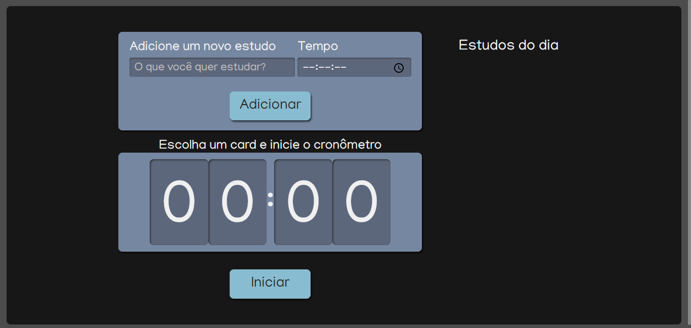

# Alura-Studies

To-do list de estudos com temporizador desenvolvido durante o curso de introdutório de React com Typescript da [Alura](https://cursos.alura.com.br/course/react-modernizando-escrever-typescript)
  

## Tecnologias:

- [Create React App](https://create-react-app.dev)
- [React](https://reactjs.org)
- [Typescript](https://www.typescriptlang.org)
- [Sass](https://sass-lang.com)

 

